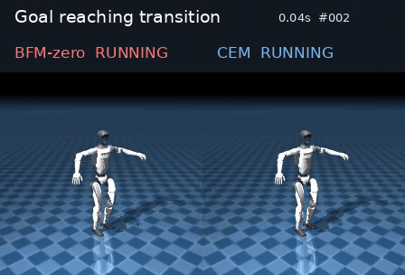
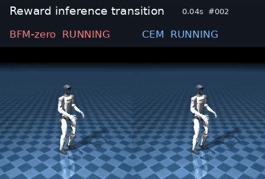
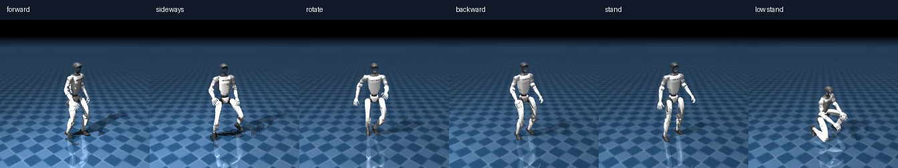
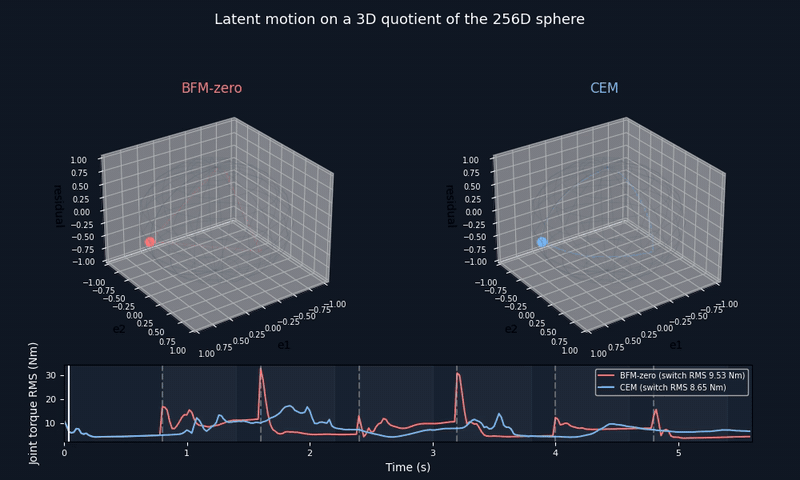
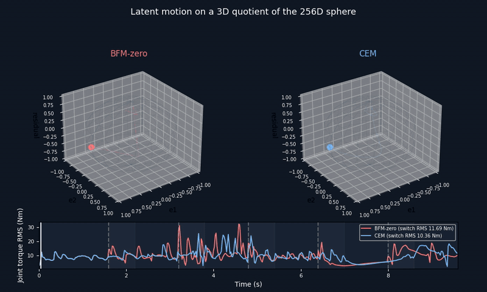
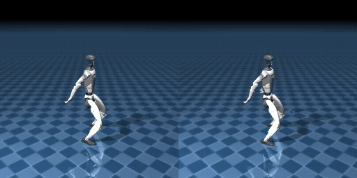

<h1 align="center">UFO · G1 23DoF with Test-Time Z-Bridge</h1>

<p align="center">基于 <a href="https://github.com/Roboparty/UFO">原始 UFO</a>：LaFAN 动作重定向 → 23DoF FB 重新训练 → 测试时连续潜变量路径规划。</p>

## Comparison

| 环节 | [UFO/BFM-zero](https://github.com/Roboparty/UFO/blob/main/README.md) | 本版本 |
| --- | --- | --- |
| G1 基准 | [29DoF 配置](https://github.com/Roboparty/UFO/blob/main/configs/robots/g1_29dof.yaml) | [23DoF 配置](configs/robots/g1_23dof.yaml) |
| 动作数据 | 已处理的 29DoF LaFAN 数据 | [关节映射 + 手臂 IK 重定向](humanoidverse/tools/retarget_g1_29dof_to_23dof.py)，40 条完整动作、902 条训练切片；[数据 manifest](configs/data/lafan_g1_23dof_ik.yaml) |
| 模型 | 原始机器人配置下训练 | 23DoF FB 重新训练，使用匹配的关节顺序和动作空间 |
| 任务切换 | goal 使用固定向量，reward 按任务推理，直接切换 | 测试时 [CEM](humanoidverse/goal_transition.py) 在 MJLab 并行 rollout 中搜索固定时长的球面 `z` 路径进行平滑切换 |

## Results

<p align="center">
  <a href="assets/demos/goal/comparison.mp4"></a>
  <a href="assets/demos/reward/comparison.mp4"></a>
</p>

<p align="center">左侧 7 个 goal、6 次切换（5.6 s）；右侧 6 个 reward 任务、5 次切换（9.6 s）。</p>

<p align="center"><br><sub>Reward 任务顺序：前进 → 侧移 → 旋转 → 后退 → 站立 → 低姿态站立</sub></p>

| 场景 | 机器人对照 | `z` 球面 + 逐步关节力矩 | 指标图 | 切换区间关节速度 RMS | 切换区间最大关节力矩 |
| --- | --- | --- | --- | ---: | ---: |
| Goal reaching | [MP4](assets/demos/goal/comparison.mp4) | [MP4](assets/demos/goal/z_sphere.mp4) | [PNG](assets/demos/goal/transition_metrics.png) | 2.120 → **1.324 rad/s** | 117.431 → **58.742 Nm** |
| Reward inference | [MP4](assets/demos/reward/comparison.mp4) | [MP4](assets/demos/reward/z_sphere.mp4) | [PNG](assets/demos/reward/transition_metrics.png) | 1.516 → **1.194 rad/s** | 96.772 → **78.551 Nm** |

以上 goal、reward 与下方 dance tracking 均使用 `ufo_fb_g1_23dof_4096_seed4728_stable` checkpoint（102,498,304 transitions）。

### z 球面轨迹与关节力矩

<p align="center"><a href="assets/demos/goal/z_sphere.mp4"></a><br><sub>Goal reaching：上方为 z 球面投影，下方为逐步关节力矩 RMS · 点击查看高清 MP4</sub></p>

<p align="center"><a href="assets/demos/reward/z_sphere.mp4"></a><br><sub>Reward inference：上方为 z 球面投影，下方为逐步关节力矩 RMS · 点击查看高清 MP4</sub></p>

详细指标见[实验报告](mdreport/UFO_GOAL_TRANSITION_CEM_EXPERIMENT.md)。

<p align="center"><a href="assets/demos/tracking/dance_reference_vs_policy.mp4"></a><br><sub>23DoF FB tracking 评估：参考动作 / 策略动作 · <a href="assets/demos/tracking/dance_reference_vs_policy.mp4">播放 MP4</a></sub></p>

## 快速运行

以下命令均从仓库根目录执行。大型数据和 checkpoint 不随 Git 发布；默认将外置数据放在仓库同级的 `../data/UFO/`，其中包含 `lafan_g1_23dof_ik/`、`cache/` 和 `runs/`。[数据 manifest](configs/data/lafan_g1_23dof_ik.yaml) 通过 `UFO_DATA_ROOT` 读取它。数据位于其他位置时，在运行前设置该变量即可。23DoF XML 和 mesh 已随仓库提供。

```bash
export UFO_DATA_ROOT="${UFO_DATA_ROOT:-$(pwd)/../data/UFO}"
export UFO_CACHE_DIR="$UFO_DATA_ROOT/cache"
export CUDA_VISIBLE_DEVICES=0
uv sync --frozen
```

### 1 · Retarget 与训练

输入为 G1 29DoF RobotState CSV；目标是 G1 23DoF XML。将原始 29DoF XML 放在 `$UFO_DATA_ROOT/source/g1_29dof.xml`，LaFAN CSV 放在 `$UFO_DATA_ROOT/source/lafan/csv/`。脚本按关节名映射，再用 IK 调整保留的手臂关节，输出逐动作 NPZ。

```bash
uv run python -m humanoidverse.tools.retarget_g1_29dof_to_23dof \
  --source-xml "$UFO_DATA_ROOT/source/g1_29dof.xml" --target-xml humanoidverse/data/robots/g1_23dof/g1_23dof.xml \
  --input-dir "$UFO_DATA_ROOT/source/lafan/csv" --output-dir "$UFO_DATA_ROOT/lafan_g1_23dof_ik/npz" \
  --report "$UFO_DATA_ROOT/lafan_g1_23dof_ik/reports/retarget_report.json"
```

```bash
./run_train.sh --agent fb --gpu-ids single \
  --data-manifest configs/data/lafan_g1_23dof_ik.yaml --robot-config configs/robots/g1_23dof.yaml \
  --num-envs 4096 --num-agent-updates 64 --num-env-steps 192000000 \
  --update-z-every-step 100 --buffer-size 5120000 \
  --work-dir "$UFO_DATA_ROOT/runs/my_g1_23dof_fb"
```

`--num-env-steps` 是累计 transitions 上限。训练数据由 manifest 自动转成切片；下方 goal/reward 使用完整 motion，dance tracking 演示使用训练切片。
训练入口省略 `--work-dir` 时写入 `runs/ufo_fb_g1_23dof_new`；示例显式使用独立目录，避免续训并改写演示所用的 stable checkpoint。

### 2 · Tracking、Goal 与 Reward 推理

先指定与 23DoF 配置匹配的模型和 motion cache。以下 goal/reward 命令生成 **CEM** 结果；将 `--transition-mode cem` 改为 `hard` 可生成同任务的直接切换基线。
三个推理入口省略 `--model-folder` 时默认读取 `UFO_DATA_ROOT/runs/ufo_fb_g1_23dof_4096_seed4728_stable`；设置 `UFO_MODEL` 或显式传 `--model-folder` 可覆盖。

```bash
export UFO_MODEL="$UFO_DATA_ROOT/runs/ufo_fb_g1_23dof_4096_seed4728_stable"
export UFO_MOTION="$UFO_DATA_ROOT/cache/motion_data/lafan_g1_23dof_ik/lafan_g1_23dof_ik_full_ufo.pkl"
export UFO_TRACKING_MOTION="$UFO_DATA_ROOT/cache/motion_data/lafan_g1_23dof_ik/lafan_g1_23dof_ik_train_near10s_ufo.pkl"
```

README 中的跳舞对照是训练切片 `dance1_subject1__clip007`（ID 7），与完整动作数据中的 ID 7 含义不同。

```bash
uv run python -m humanoidverse.tracking_inference \
  --model-folder "$UFO_MODEL" --data-path "$UFO_TRACKING_MOTION" --robot-config configs/robots/g1_23dof.yaml \
  --motion-list 7 --max-steps 300 --headless true --save-mp4 true \
  --disable-dr true --disable-obs-noise true --render-size 256 --export-onnx false
```

```bash
uv run python -m humanoidverse.goal_inference \
  --model-folder "$UFO_MODEL" --data-path "$UFO_MOTION" --robot-config configs/robots/g1_23dof.yaml \
  --goal-json configs/goals/lafan_g1_23dof_ik.json --goal-indices 13 11 12 11 13 4 5 \
  --episode-len 280 --goal-switch-interval 40 --transition-mode cem --transition-steps 30 \
  --cem-candidates 6 --cem-iterations 2 --cem-knots 3 --cem-basis-dim 2 --goal-tolerance 0.25 \
  --headless true --save-mp4 true --disable-dr true --disable-obs-noise true --render-size 224 \
  --transition-output-dir "$UFO_DATA_ROOT/goal_transition_experiments/repro_7_goals"
```

```bash
uv run python -m humanoidverse.reward_inference \
  --model-folder "$UFO_MODEL" --data-path "$UFO_MOTION" --robot-config configs/robots/g1_23dof.yaml \
  --reward-latents-path "$UFO_MODEL/reward_inference/reward_locomotion.pkl" \
  --tasks move-ego-0-0.3 move-ego-90-0.3 rotate-z-5-0.5 move-ego-180-0.3 move-ego-0-0 move-ego-low0.5-0-0 \
  --episode-length 80 --transition-mode cem --transition-steps 30 \
  --cem-candidates 6 --cem-iterations 2 --cem-knots 3 --cem-basis-dim 2 \
  --headless true --save-mp4 true --disable-dr true --disable-obs-noise true --render-size 224 \
  --transition-output-dir "$UFO_DATA_ROOT/reward_transition_experiments/repro_6_tasks"
```

Reward `z` 也可从同一 checkpoint 的 replay 重新推断：去掉 `--reward-latents-path`，保留 `--tasks`；这会读取 replay，耗时和内存开销较大。Goal CEM 将末步平均关节角误差作为可行性条件；两种 CEM 都考虑关节速度 RMS、峰值速度、关节行程、峰值力矩和仿真失败。CEM 每次切换都运行候选 rollout，当前用于离线仿真实验。

### 3 · 合成对照视频与曲线

先在同一 `--transition-output-dir` 分别运行 `hard` 和 `cem`。以 goal 为例：

```bash
uv run python -m humanoidverse.tools.compare_latent_transitions \
  --hard-summary "$UFO_DATA_ROOT/goal_transition_experiments/repro_7_goals/goal_hard_summary.json" \
  --cem-summary "$UFO_DATA_ROOT/goal_transition_experiments/repro_7_goals/goal_cem_summary.json" \
  --output-dir "$UFO_DATA_ROOT/goal_transition_experiments/repro_7_goals" --fps 50
```

输出 `comparison.mp4`、`z_sphere.mp4`、`transition_metrics.png/CSV/JSON`。Reward 使用同一工具，输入改为 `reward_sequence_hard_0_summary.json` 和 `reward_sequence_cem_0_summary.json`。更多可视化说明见 [mdreport](mdreport/UFO_GOAL_TRANSITION_CEM_EXPERIMENT.md)。

---

本版本基于 [Roboparty/UFO](https://github.com/Roboparty/UFO) 的代码，加入了 23DoF 数据重定向、重新训练与测试时 Z-Bridge 路径寻优；原项目作者未参与或认可本版本。原项目许可与引用信息见 [LICENSE](LICENSE)。
